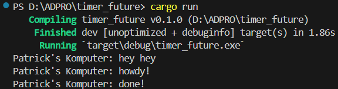
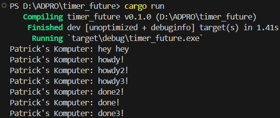

## Experiment 1.2
 \
The output order is due to the asynchronous nature of the tasks. The line “Patrick’s Komputer: hey hey” is printed immediately because it’s a synchronous operation. The other lines are printed later by an asynchronous task that was queued to run after the synchronous operations. This task prints “Patrick’s Komputer: howdy!”, waits for 2 seconds, and then prints “Patrick’s Komputer: done!”. So, the output order is not the same as the order in the code.

## Experiment 1.3
 \
`drop(spawner)` in the code signals to the `Executor` that no more tasks will be added to the queue. When it is removed, the `Executor` might keep waiting for more tasks even after all tasks have been executed. This leads to the program not terminating. 
